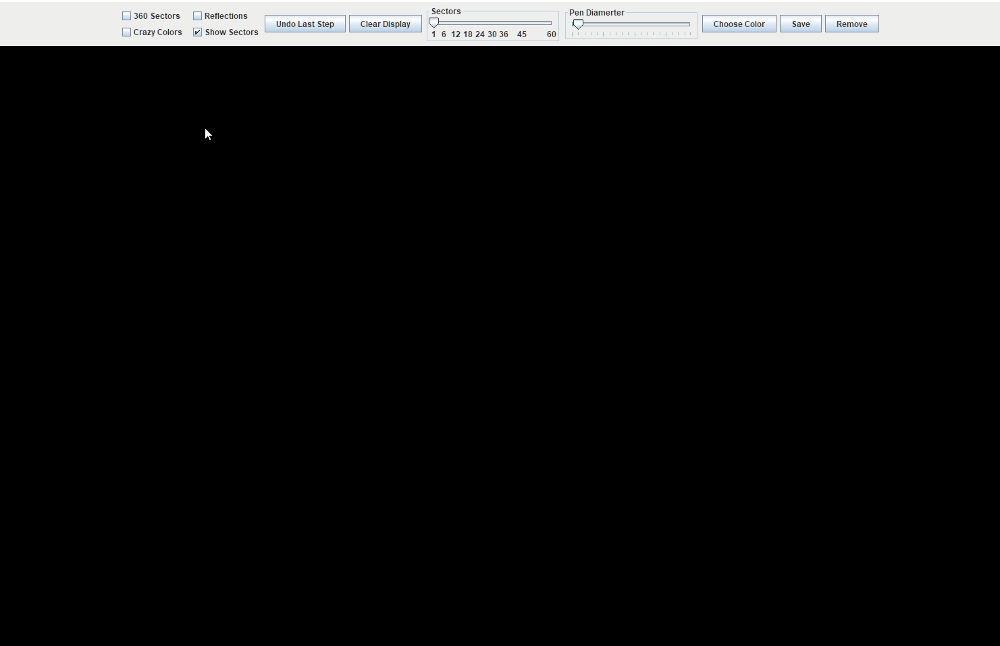
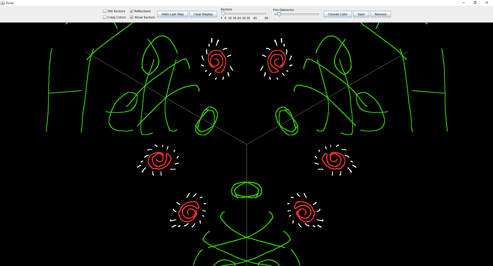
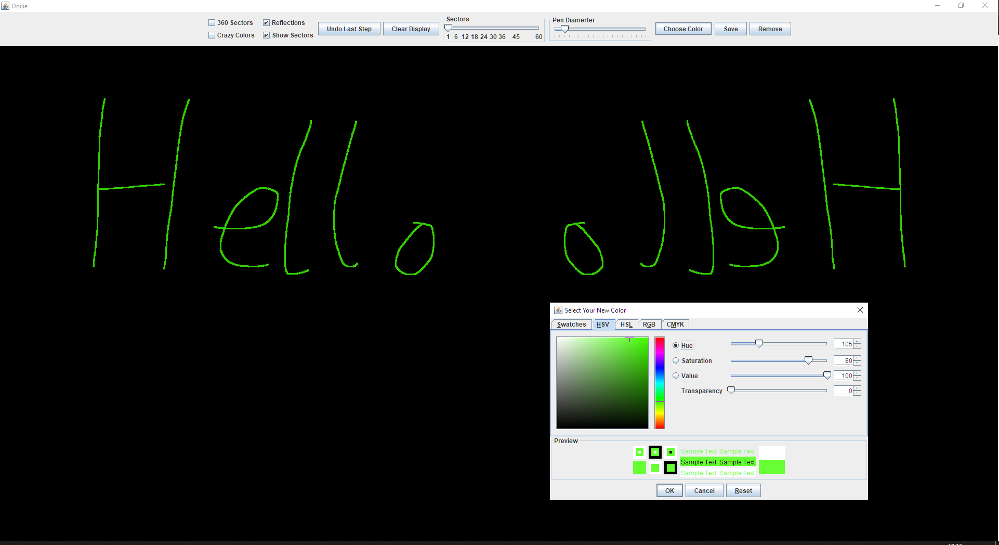
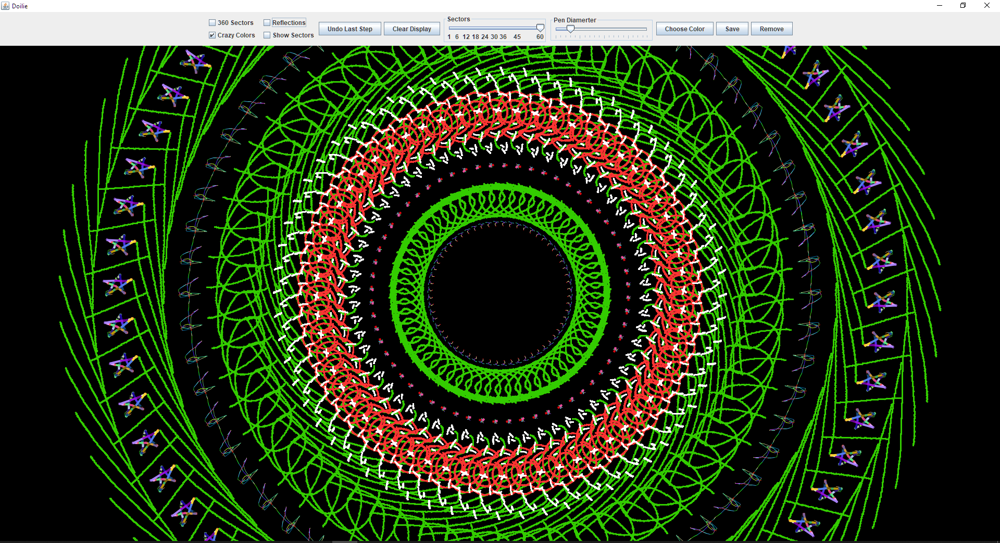

# Digital-Doily

## Description
- Painting application with some quirks and features
- The user painting can be mirrored and duplicated up to 360 times on the canvas
- There are features to change colours, brush widths, number of **duplication sectors**
- Users can save their pictures as .JPEG files and browse the gallery inside the application 
- Clicking the **Crazy colours** checkbox starts randomising the brush colour. (This is done with a separate thread that randomises the colour every 50ms) 

## Setup project locally
- Java 8
- Java AWT
- Java Swing

## Additional Pictures

